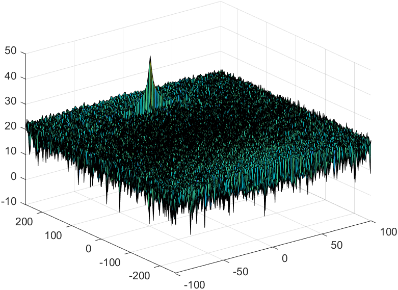
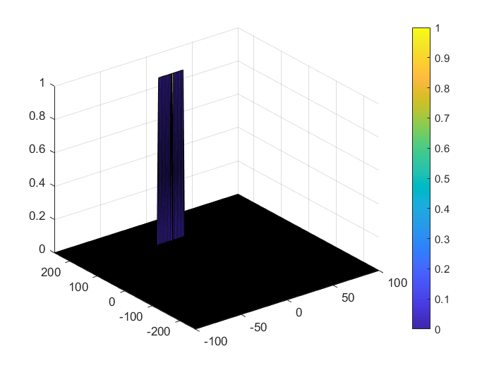

# Radar Target Generation and Detection
In this project, we will simulate the process of Target generation and detection pipeline in MATLAB using simple wave simulation based on design requirements of radar sensor as shown in the following figure


## Pipeline Requirements
* Configure the FMCW waveform based on the system requirements.
* Define the range and velocity of target and simulate its displacement.
* For the same simulation loop process the transmit and receive signal to determine the beat signal
* Perform Range FFT on the received signal to determine the Range
* Towards the end, perform the CFAR processing on the output of 2nd FFT to display the target.

## CFAR Implementation Steps

* Starting from the output of 2D FFT on Radar Raw signal



* Determine the number of Training cells for each dimension. Similarly, pick the number of guard cells.
> Chosen of these numbers are based on trial and error method , worth noting that these numbers also can affect the output accuracy
```Matlab
%Select the number of Training Cells in both the dimensions.
Tr=12;
Td=6;
%Select the number of Guard Cells in both dimensions around the Cell under 
%test (CUT) for accurate estimation
Gr=4;
Gd=4;
% offset the threshold by SNR value in dB
offset=6;
```
* Slide the cell under test across the complete matrix. Make sure the CUT has margin for Training and Guard cells from the edges.
For every iteration sum the signal level within all the training cells. To sum convert the value from logarithmic to linear using db2pow function.
* Average the summed values for all of the training cells used. After averaging convert it back to logarithmic using pow2db.
* Further add the offset to it to determine the threshold.
* Next, compare the signal under CUT against this threshold.

```Matlab
signal = RDM;
for i = 1:(Nr/2-(Gr+Tr+1))
    for j = 1:(Nd-(Gd+Td+1))
        %Measure the noise across the Training Cells
        for r = i:i+Tr-1
            for d = j:j+Td-1
                noise_level=noise_level + db2pow(RDM(r,d));
            end
        end
        threshold = pow2db(noise_level/(Td*Tr))+offset;
        cut_x = i+Tr+Gr+1;
        cut_y = j+Td+Gd+1;
        signal_T=RDM(cut_x,cut_y);
        if(signal_T<threshold)
            signal(cut_x,cut_y)=0;
        else 
            signal(cut_x,cut_y)=1;
        end
        noise_level = 0;
    end
end
```
* The process above will generate a thresholded block, which is smaller than the Range Doppler Map as the CUTs cannot be located at the edges of the matrix due to the presence of Target and Guard cells. Hence, those cells will not be thresholded.
To keep the map size same as it was before CFAR, equate all the non-thresholded cells to 0.
```Matlab
signal(:,1:Td+Gd+1)=0;
signal(1:(Tr+Gr+1),:)=0;
```

* The output of the CFAR algorthim is then used for Target detections clustering and tracking

